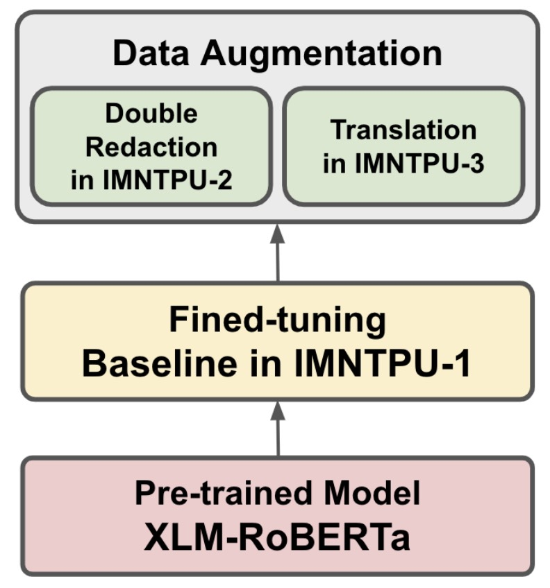

#  Data Augmentation for Financial Numclaim Classification

NTCIR-16 conference: [NTCIR-16](https://research.nii.ac.jp/ntcir/ntcir-16/conference-ja.html)

FinNum-3 task: [FinNum-3](https://sites.google.com/nlg.csie.ntu.edu.tw/finnum3/)

Our paper: [IMNTPU at the NTCIR-16 FinNum-3 Task](https://research.nii.ac.jp/ntcir/workshop/OnlineProceedings16/pdf/ntcir/08-NTCIR16-FINNUM-TengY.pdf)

This repository contains the implementation of numerical claim detection models for the NTCIR-16 FinNum-3 shared task. The project focuses on detecting whether numbers in financial social media texts represent claims or not.

## Project Structure
```
src/
├── models/
│ ├── en/ # English models
│ └── zh/ # Chinese models
├── data/ # Dataset files
├── poster/ # Poster
└── README.md # This file
```

## Research Architecture


## Models

### Chinese (ZH)
- MacBERT Large
- XLM-RoBERTa Base
- XLM-RoBERTa with Data Augmentation
- XLM-RoBERTa with Double Redaction

### English (EN)
- XLM-RoBERTa Base
- XLM-RoBERTa with Data Augmentation
- XLM-RoBERTa with Double Redaction

## Features

- Text preprocessing with special token insertion
- Data augmentation using translation (ZH ↔ EN)
- Double redaction technique for robust training
- Mixed precision training (FP16)
- Various evaluation metrics:
  - Accuracy
  - F1 Score (Micro & Macro)
  - Matthews Correlation Coefficient
  - Cohen's Kappa
  - Jaccard Index

## Model Training Details

- Batch size: 8
- Learning rate scheduling: One Cycle Policy
- Optimizer: Lamb with weight decoupling
- Loss function: Cross Entropy with class weights
- Mixed precision training (FP16)
- Learning rates:
  - Initial: 1.2e-5 ~ 8.3e-4
  - Progressive reduction through training phases

## Results

Results are saved in JSON format under the `result/` directory, containing:
- Text
- Target numeral
- Offset
- Category (for dev set)
- Claim prediction

## Acknowledgments

This work is part of the NTCIR-16 FinNum-3 shared task. The research was supported in part by the Ministry of Science and Technology (MOST), Taiwan under grant number 110-2410-H-305-013-MY2, and National Taipei University (NTPU) under grant number 110-NTPU-ORDA-F-001, 111-NTPU-ORDA-F-001, and 111-NTPUORDA-F-003.

